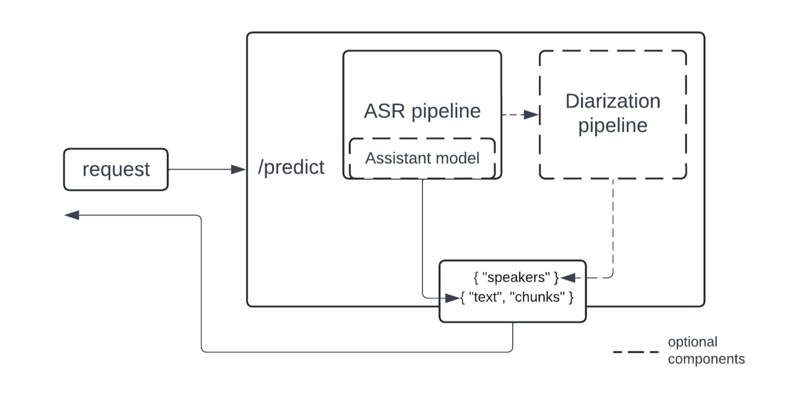

This is a high-level diagram of what the extractor looks like under the hood:

The implementation of ASR and diarization pipelines is modularized to cater to a wider range of use cases - the diarization pipeline operates on top of ASR outputs, and you can use only the ASR part if diarization is not needed. For diarization, we propose using the [Pyannote model](https://huggingface.co/pyannote/speaker-diarization-3.1), currently a SOTA open source implementation.

We’ll also add speculative decoding as a way to speed up inference. The speedup is achieved by using a smaller and faster model to suggest generations that are validated by the larger model. Learn more about how it works with Whisper specifically in [this great blog post](https://huggingface.co/blog/whisper-speculative-decoding).

Speculative decoding comes with restrictions:

- at least the decoder part of an assistant model should have the same architecture as that of the main model
- the batch size much be 1

Make sure to take the above into account. Depending on your production use case, supporting larger batches can be faster than speculative decoding. If you don't want to use an assistant model, just keep the `assistant_model` in the configuration as `None`.

If you do use an assistant model, a great choice for Whisper is a [distilled version](https://huggingface.co/distil-whisper).