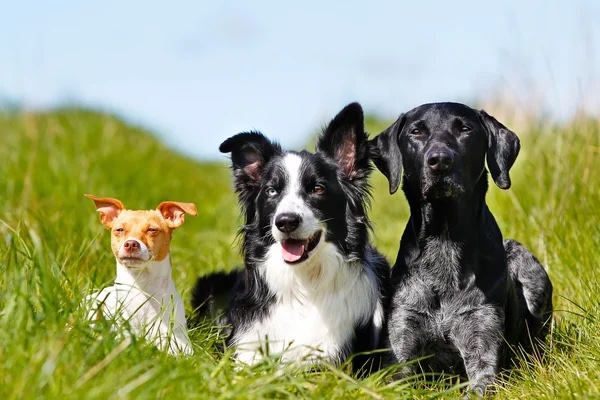

# Grounding Dino Object Detector
This extractor uses Grounding DINO model and accepts an (image, text prompt) pair as inputs and is based on [IDEA-Research GroundingDINO](https://github.com/IDEA-Research/GroundingDINO)

GroundingDINO is a technique or model in the field of artificial intelligence and computer vision that focuses on improving the interpretability and functionality of vision transformers. DINO, which stands for "DIstillation with NO labels," is a self-supervised learning method for training vision transformers, a type of neural network architecture increasingly used for image recognition and related tasks.

The concept of "grounding" in GroundingDINO refers to the model's ability to associate specific parts of an image with corresponding textual descriptions or labels, even in the absence of explicit labeling during training. This can involve identifying and highlighting areas of an image that are most relevant to a particular concept or description, essentially giving the model a form of visual "attention" that helps it focus on the most important aspects of an image for classification or analysis. 

### Example

##### input params
- prompt: str = "dog" # 
- box_threshold: float = 0.35
- text_threshold: float = 0.25

The boxes with similarity scores above the box_threshold are chosen, and words whose similarities are higher than the text_threshold as predicted labels.

To specify multiple classes you can separate them by ".", for example:
"chair . face . dog ."

To be more specific about what you want to detect, you can prompt something like this:
"chair with man sitting on it"

##### content (image/jpeg)

##### output metadata
[
  {
    "feature_type": "metadata",
    "name": "metadata",
    "value": {
      "boundingbox": [0.4833730161190033, 0.5987678170204163, 0.3368471562862396, 0.6928521394729614],
      "score": 0.8407222628593445,
      "phrase": "dog"
    }
  },
  {
    "feature_type": "metadata",
    "name": "metadata",
    "value": {
      "boundingbox": [0.7676301002502441, 0.6242724061012268, 0.3153415322303772, 0.7455269694328308],
      "score": 0.8238444328308105,
      "phrase": "dog"
    }
  },
  {
    "feature_type": "metadata",
    "name": "metadata",
    "value": {
      "boundingbox": [0.22164146602153778, 0.6886204481124878, 0.21795204281806946, 0.4135660231113434],
      "score": 0.7178258895874023,
      "phrase": "dog"
    }
  }
]