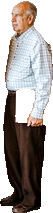

# Segment Anything Model (SAM)
This extractor uses [Facebook's SAM from huggingface](https://huggingface.co/docs/transformers/en/model_doc/sam#transformers.SamModel.forward.multimask_output) for obtaining high-quality segmentation masks from images. In order to use this extractor you must use content which has boundingbox metadata. You can leverage other object detector extractors like [Groundingdino](https://github.com/tensorlakeai/indexify-extractors/tree/main/image/groundingdino) or [yolo](https://github.com/tensorlakeai/indexify-extractors/tree/main/image/yolo) to get bounding boxes and classnames.


### input params
input params default to grounding dino extractor metadata keys but can be specified for other extractors.
- boundingbox_key: str = "boundingbox"
- class_key: str = "phrase"


### Example

In this example we have an input image with metadata from groundingdino with prompt "person".


##### Metadata

```json
[
 {
    "feature_type": "metadata",
    "name": "metadata",
    "value": {
      "boundingbox": [301,127,354,340],
      "score": 0.7729100584983826,
      "phrase": "person"
    }
  },
  ...
]
```

### Output Image Content
for each bounding box we will output the cropped masked image that we got from SAM, below is a single entry from the above photo.



##### Metadata
```json
[
 {
    "feature_type": "metadata",
    "name": "metadata",
    "value": {
      "mask_score": 0.9888,
      "classname": "person"
    }
  },
]
```