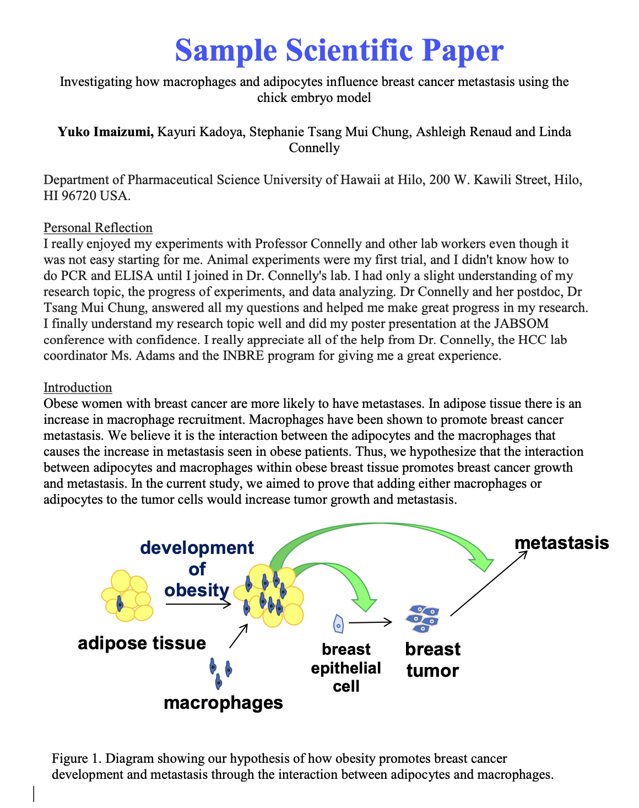

# Unstructured.io PDF Extractor
This extractor uses [unstructured](https://github.com/Unstructured-IO/unstructured) to extract data from both pdf and image files. Unstructured will extract text from key elements along with important metadata like page number and type.

### Output:
text/plain for each element found

### Input parameters
strategy: Literal['hi_res', 'fast', 'ocr_only', 'auto'] = "fast"
languages: Optional[Iterable[str]] = None

### Strategies
[Four strategies are available](https://github.com/Unstructured-IO/unstructured-api?tab=readme-ov-file#strategies) for processing PDF/Images files: hi_res, fast, ocr_only and auto. fast is the default strategy and works well for documents that do not have text embedded in images.

hi_res is the better choice for PDFs that may have text within embedded images, or for achieving greater precision of element types in the response JSON.

### Metadata:
[Metadata extracted](https://unstructured-io.github.io/unstructured/metadata.html) from unstructured also applied to the content.

detection_class_prob: Optional[float] = None # From unstructured-inference, hi-res strategy.
coordinates: Coordinates
last_modified: str
filetype: str
languages: List[str]
page_number: int
file_directory: str
filename: str
type: str

### Example

##### content (pdf):


##### output:
```json
[
  {
    "contentType": "text/plain",
    "data": "Sample Scientific Paper",
    "features": [
      {
        "featureType": "metadata",
        "name": "metadata",
        "value": {
          "coordinates": {
            "points": [
              [185.283, 41.349000000000046],
              [185.283, 69.34900000000005],
              [469.93100000000004, 69.34900000000005],
              [469.93100000000004, 41.349000000000046]
            ],
            "system": "PixelSpace",
            "layoutWidth": 612.0,
            "layoutHeight": 792.0
          },
          "fileDirectory": "/var/folders/04/ysg_dpf16px3f4_bq92dpxww0000gn/T",
          "filename": "tmp3n50zewo.pdf",
          "languages": ["eng"],
          "lastModified": "2024-03-14T11:52:33",
          "pageNumber": 1,
          "filetype": "application/pdf",
          "type": "Header"
        }
      }
    ]
  },
  {
    "contentType": "text/plain",
    "data": "Investigating how macrophages and adipocytes influence breast cancer metastasis using the chick embryo model",
    "features": [
      {
        "featureType": "metadata",
        "name": "metadata",
        "value": {
          "coordinates": {
            "points": [
              [86.04, 74.48399999999992],
              [86.04, 100.28399999999988],
              [528.8363999999996, 100.28399999999988],
              [528.8363999999996, 74.48399999999992]
            ],
            "system": "PixelSpace",
            "layoutWidth": 612.0,
            "layoutHeight": 792.0
          },
          "fileDirectory": "/var/folders/04/ysg_dpf16px3f4_bq92dpxww0000gn/T",
          "filename": "tmp3n50zewo.pdf",
          "languages": ["eng"],
          "lastModified": "2024-03-14T11:52:33",
          "pageNumber": 1,
          "parentId": "42a49f252ef50427f37b1b9280f06cc8",
          "filetype": "application/pdf",
          "type": "NarrativeText"
        }
      }
    ]
  }...
```

### Additional Language Support
This extractor depends on having [tesseract](https://github.com/tesseract-ocr/tesseract) installed.

Install for Mac users
```bash
brew install tesseract
```

Install for Linux/Ubuntu
```bash
sudo apt install tesseract-ocr
```

To view currently installed language packs
```bash
tesseract --list-langs
```

To search for additional language packs:

Linux
```bash
apt search tesseract-ocr
```

Install language packs on Mac
```bash
brew install tesseract-lang
```